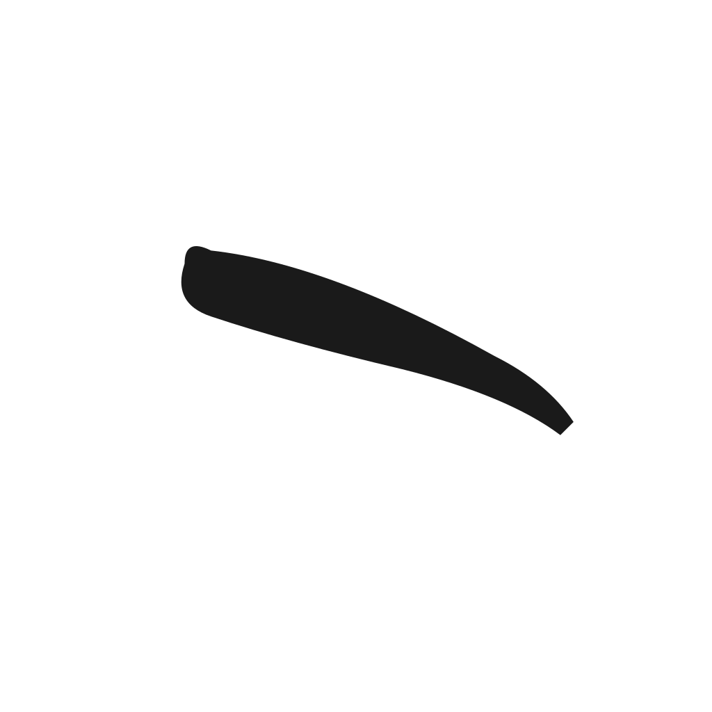

<p align="center">
  
</p>

<h1 align="center">Sumi 墨</h1>

<p align="center">
  <strong>日本人による、日本人のための、美しく静かなキーボード</strong>
</p>

<p align="center">
  <a href="LICENSE"></a>
  
  
  
</p>

---

## なぜ Sumi か

毎日、あなたは何百回もキーボードに触れます。その時間に広告は要らない。あなたの一文字を企業に売る必要もない。

**Sumi は、あなたが日本語を打つために存在する唯一のキーボード。広告も課金も追跡もない。永遠に。**

- 🆓 **完全無料** — Pro版もアプリ内課金もなし
- 🚫 **広告ゼロ** — キーボードに広告は不要
- 🔒 **入力を一切送信しない** — あなたの言葉はあなたのもの
- 🎨 **ミニマルなデザイン** — 余計なものは描かない
- 🇯🇵 **日本人のため** — 日本語の入力体験に最適化

---

## 特徴

| 機能 | 内容 |
|---|---|
| ⌨️ 入力方式 | フリック12キー / QWERTYローマ字、瞬時に切替 |
| 📖 辞書 | 5,036語のN1漢字変換辞書を内蔵 |
| 🤖 AI候補 | 任意・オプトイン（あなた自身のAPIキーで Claude を呼び出し） |
| ⚙️ 設定 | テーマ、フリック感度、長押し遅延などをきめ細かく調整 |
| 🌓 ダークモード | 自動/ライト/ダーク |
| 🔇 静音モード | キー音オフ、バイブのみ |

---

## プライバシー誓約

Sumi はあなたの入力を**一切収集しません**。

- アナリティクスなし
- テレメトリなし
- 広告SDKなし
- 端末識別子の取得なし

詳細は [プライバシーポリシー](PRIVACY.md) をご覧ください。

---

## インストール

### Google Play Store

近日公開予定

### 開発者ビルド

```bash
git clone https://github.com/yasunori-ogawa/sumi.git
cd sumi
./gradlew installDebug  # Android端末をUSB接続後
```

---

## 使い方

1. 端末の **設定 → 言語と入力 → キーボードを管理** で「Sumi」を有効化
2. テキスト入力欄をタップ → キーボード選択で「Sumi」を選ぶ
3. フリック⇄QWERTY 切替は左下の `あA1` キー

---

## 開発

### 必要環境

- Android Studio（AGP 9.x 以降）
- Android SDK 26 以降
- JDK 17
- Kotlin 2.2 以降

### ビルド

```bash
./gradlew assembleDebug
```

APK は `app/build/outputs/apk/debug/` に生成されます。

### 辞書への語彙追加

`app/src/main/assets/dict/common.json` を編集。形式：

```json
{
  "ひらがな": ["漢字候補1", "漢字候補2"]
}
```

プルリクエスト歓迎です。

---

## コントリビューション

- バグ報告・機能要望は [Issues](../../issues) へ
- 大きな変更を加える前に Issue で議論をお願いします
- コードスタイルは既存に合わせてください

---

## デザイン哲学

Sumi のUIは以下のデザイナーの思想を骨格としています：

- **原研哉**（『白』『デザインのデザイン』）— 余白の力
- **Dieter Rams** — Less, but better
- **Paul Rand**（『Thoughts on Design』）— 事物の品質から意味を得る
- **Saul Bass** — 象徴し要約する
- **Jonathan Ive** — 細部までの誠実さ

アプリアイコン「一筆の払い」は、ユーザーがSumiで打つ「最初の一画」を象徴します。

---

## ライセンス

MIT License. [LICENSE](LICENSE) を参照。

---

## 謝辞

- すべての貢献者の皆様
- Anthropic 社（Claude API）
- mozc プロジェクト（将来の辞書統合計画）
- 日本語入力技術の先人たち

